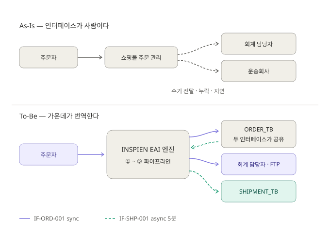
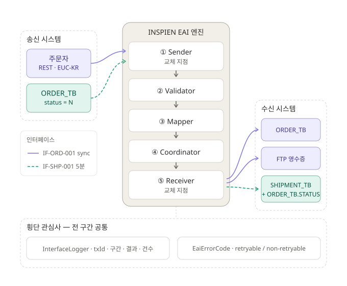
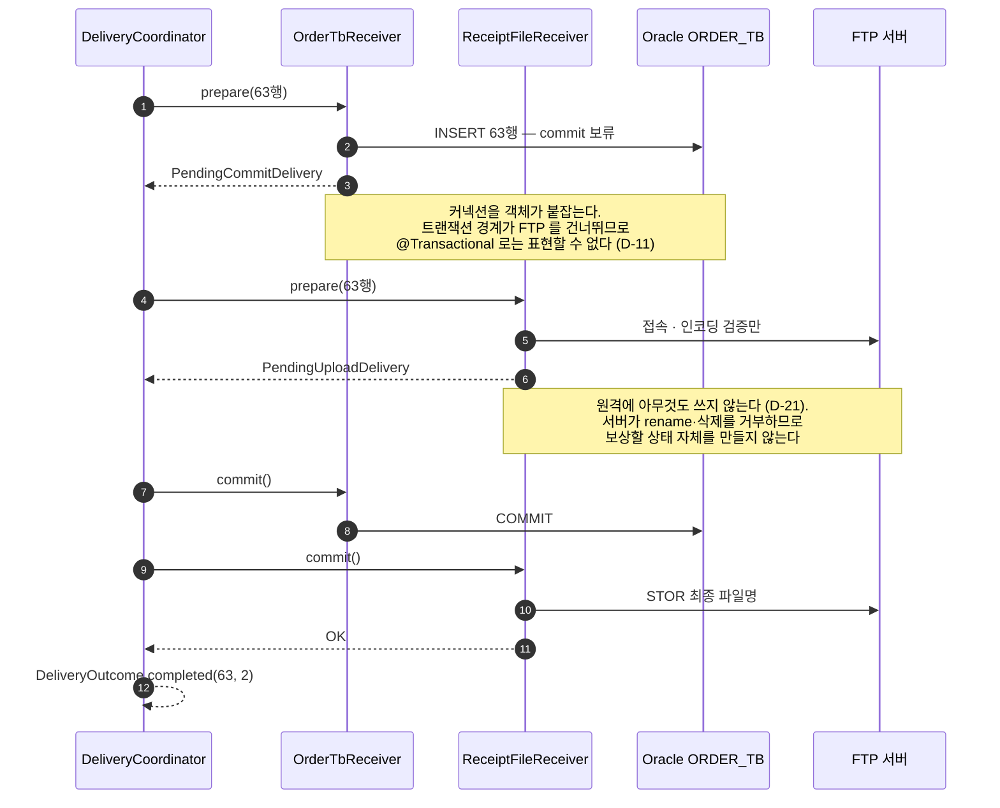
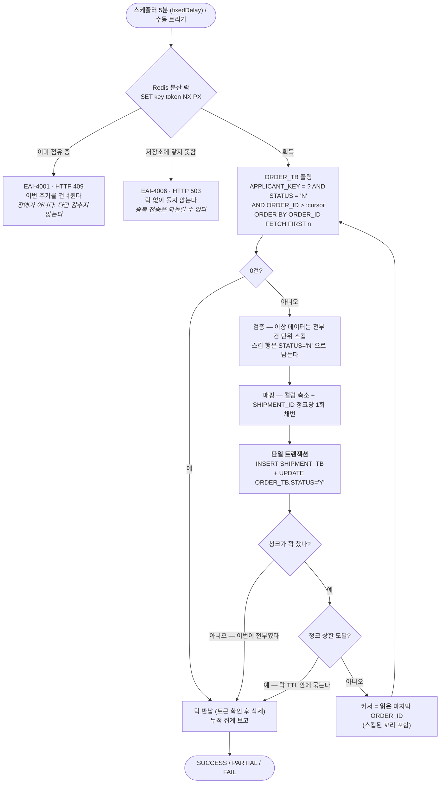

# To-Be 아키텍처

> 과제 3.4 — "처음 제시된 문제 시나리오에서 제출 과제로 인해 변화된 아키텍처"
>
> 설계 결정 번호(D-01 ~ D-26)는 [인터페이스 정의서](interface-spec.md)에 근거와 함께 기록돼 있다.

## 세 줄 요약

- 주문·회계·운송 세 시스템을 **합치지 않고** 가운데에 연계 엔진 하나를 넣었다.
- 인터페이스는 둘(실시간 주문 / 5분 배치)이지만 **파이프라인은 하나**다. Sender 와 Receiver 만 갈아 끼운다.
- FTP 는 DB 트랜잭션에 참여할 수 없으므로 **보상 트랜잭션**으로 정합성을 맞추고, 배치는 **분산 락 + 커서 페이징**으로 겹침과 재처리를 다룬다.

## 그림 넷

**그림 1·2 가 제출용 본체**이고, 그림 3·4 는 그림 2 의 한 칸(④ Coordinator, IF-SHP-001 루프)을 확대한 것이다.

| 그림 | 무엇을 주장하는가 | 형식 | 용도 |
|---|---|---|---|
| 1. As-Is → To-Be | 사람이 하던 인터페이스를 한 지점으로 모았다 | SVG | 제출 이미지 |
| 2. To-Be 계층도 | 인터페이스가 둘인데 구조는 하나다 | SVG | 제출 이미지 · 발표 메인 |
| 3. 보상 트랜잭션 | 2PC 가 불가능한 이기종 리소스의 정합성 | Mermaid | 발표 보조 |
| 4. 배치 청크 루프 | 겹침 방지와 재처리를 어떻게 보장하는가 | Mermaid | 발표 보조 |

---

## 1. As-Is → To-Be

배경 스토리의 문제는 시스템이 없다는 것이 아니라 **인터페이스가 사람**이라는 것이다.
주문·회계·운송이 각각 다른 방식으로 돌고, 그 사이를 수기로 옮기니 누락과 지연이 생긴다.



**이 그림이 주장하는 것.** 세 시스템은 To-Be 에서도 **그대로 남아 있다.** 하나로 합치지 않았다.
사전 안내가 구분한 그대로다 — ERP 는 시스템을 하나로 **통합**하고, EAI 는 시스템을 각자
그대로 두고 가운데에서 **연결**한다. 우리가 만든 것은 새로운 주인이 아니라 번역자다.

그래서 이 프로젝트에는 도메인 모델이 없고 JPA 도 쓰지 않는다. ORM 으로 엔티티를 만드는 순간
"우리가 이 데이터를 소유한다" 는 잘못된 신호가 되며, `ORDER_TB` 는 우리 것이 아니다.

`ORDER_TB` 상자가 **화살표를 양쪽으로 받는 것**이 그 사실의 표현이다. IF-ORD-001 은 그 테이블에
쓰고(수신), IF-SHP-001 은 같은 테이블에서 읽는다(송신). 우리가 방금 넣은 데이터라도 다시 읽을
때는 남의 시스템으로 취급해 다시 검증한다 (D-23).

---

## 2. To-Be 계층도 — 인터페이스는 둘, 구조는 하나



보라 실선이 IF-ORD-001, 청록 점선이 IF-SHP-001 이다. **두 색이 같은 엔진 기둥을 통과한다**는 것이
이 그림의 전부다. 갈라지는 곳은 ①과 ⑤ 두 칸뿐이다.

### 교체 지점에 무엇이 끼워지는가

②③④와 로깅·예외 체계는 인터페이스가 늘어도 **한 줄도 바뀌지 않는다.**

| | IF-ORD-001 (실시간 주문) | IF-SHP-001 (운송사 배치) |
|---|---|---|
| 트리거 | REST 요청 — 본문이 곧 정보 | 스케줄러 5분 / 수동 — `PollCursor` 뿐 |
| 성격 | SYNC — 호출자가 기다린다 | ASYNC — 호출자가 없다 |
| ① Sender | `OrderRestSender` (push) | `JdbcPollingSender` (pull) |
| ② Validator | `OrderValidator` — 치명적 위반 있음 | `ShipmentValidator` — **전부 건 단위 스킵** (D-23) |
| ③ Mapper | HEADER 1 × ITEM n → n행 (평탄화) | 1행 → 1행 (컬럼 축소) |
| ④ Coordinator | `OrderedDeliveryCoordinator` (JDBC → FTP) | `OrderedDeliveryCoordinator` (JDBC) |
| ⑤ Receiver | `OrderTbReceiver` + `ReceiptFileReceiver` | `ShipmentTbReceiver` (INSERT + STATUS 갱신) |
| 실패 회복 | 응답 → 호출자가 고쳐 다시 보낸다 | 다음 주기가 자연 재처리 |

**이 표가 그림 2 의 진짜 내용이다.** 과제가 요구한 것은 기능 두 벌이 아니라 연계 구조 하나이며,
`Sender` 인터페이스가 존재하는 이유가 바로 이 열 여덟 개의 차이를 두 칸에 가두는 것이다.

### 왜 가운데에 표준 메시지를 두는가

`CanonicalMessage` 는 송신 형식(EUC-KR XML)도 수신 형식(Oracle 행 / `^` 구분 텍스트)도 아닌
중립 표현이다. 없으면 변환 조합이 **송신 N × 수신 M** 이지만, 가운데를 두면 **N + M** 이 된다.
사전 안내가 지적한 Point-to-Point 폭증 문제를 코드 레벨에서 막는 장치다.

실무적 귀결은 이렇다 — 송신이 XML 에서 JSON 으로 바뀌어도 ③ 이후는 손대지 않고,
수신처가 하나 늘어도 ⑤ 를 하나 추가하면 된다.

검증 가능한 증거가 하나 있다. IF-SHP-001 을 추가하면서 **`Step` 열거형이 하나도 늘지 않았다.**
구간을 도메인(`RECEIVER_ORDER_TB`)이 아니라 프로토콜(`RECEIVER_JDBC`) 단위로 나눴기 때문이다.
운영자가 알아야 하는 것은 "어느 종류의 상대 시스템에 연락할 것인가" 이고, 그것은 테이블 이름이
아니라 프로토콜로 결정된다.

### 두 인터페이스가 한 상태를 공유한다

`ORDER_TB.STATUS` 는 두 인터페이스가 공유하는 유일한 상태다. 그림에서 `ORDER_TB` 가
송신과 수신에 **두 번 등장**하는 것이 그 사실의 표현이다.

```
IF-ORD-001 (적재) : STATUS = 'N' 으로 넣는다
IF-SHP-001 (조회) : WHERE STATUS = 'N' 으로 찾는다
IF-SHP-001 (갱신) : STATUS = 'Y' 로 바꾼다
```

세 자리가 각자 리터럴 `"N"` 을 들고 있으면 한쪽만 바뀌었을 때 **실패가 예외로 나타나지 않는다.**
배치는 조용히 0건을 처리하고 성공을 보고하며, 주문은 영원히 배송되지 않는다. 컴파일도 테스트도
통과한다. 그래서 `OrderStatus` 열거형 하나로 묶었고, 그 어휘의 주인은 값의 의미를 정하는 쪽
(`integration.order`)에 둔다.

### 횡단 관심사가 아래에 깔린 이유

`InterfaceLogger` 와 `EaiErrorCode` 는 특정 구간의 부품이 아니라 **전 구간이 같은 규칙으로**
쓰는 것이다. 구간마다 로그 한 줄이 남고(`txId` 로 묶인다), 어떤 예외든 코드를 달고 나간다.

로그에 개인정보(`NAME`·`ADDRESS`)가 실리지 않는 것은 마스킹 때문이 아니라 **스키마에 자리가
없기** 때문이다. 남기는 것은 건수·구간·결과·에러 코드뿐이다. 마스킹은 규칙을 한 곳에서
빠뜨리면 그대로 새지만, 넣을 칸이 없으면 실수로도 넣을 수 없다.

---

## 3. 보조 ① — 보상 트랜잭션 (그림 2 의 ④ 확대)

IF-ORD-001 은 Oracle 적재와 FTP 업로드가 **둘 다** 성공해야 성공이다. 그런데 FTP 는 DB
트랜잭션에 참여할 수 없고 XA/2PC 를 걸 대상도 아니다. 순진하게 짜면 반드시 둘 중 하나가 된다.

```
DB commit → FTP 실패   ⇒ DB 에만 있는 주문 (영수증 없음)
FTP 성공  → DB 실패    ⇒ 파일에만 있는 유령 영수증
```

해법은 **준비와 확정의 분리**다. 각 Receiver 가 되돌릴 수 있는 지점까지만 진행하고 멈춘 뒤,
모두가 그 지점에 도달했을 때 순서대로 확정한다.



### 실패하면 어디로 가는가

| 실패 지점 | 조치 | 보고 |
|---|---|---|
| ① JDBC prepare | Receiver 가 스스로 롤백·커넥션 반납 | `FAIL` — 아무 데도 남지 않았다 |
| ② FTP prepare | ① 을 **역순 보상**(롤백) | `FAIL` — 재시도해도 안전하다 |
| ③ JDBC commit | ② 보상 (원격에 쓴 것이 없다) | `FAIL` |
| ④ FTP commit | **되돌리지 않는다** | `PARTIAL` + `EAI-3005` 수동 조치 |

**④ 가 이 설계의 핵심 판단이다.** 이 지점에서는 DB 63행이 이미 유효하게 들어 있다.
실패로 보고하면 호출자가 재요청하고, 그 재요청이 곧 **중복 적재**다. 필요한 조치는 재실행이
아니라 파일 하나를 올리는 일이므로, 예외로 던지지 않고 "사람이 손대야 한다" 는 사실을
결과에 실어 돌려준다 (D-14).

> 경계를 한 줄로: **예외 = 아무 데도 남지 않았다 / 반환 = 어딘가에는 남았다.**
> 이 경계가 흐려지면 호출자는 재시도해도 되는지 판단할 수 없다.

완벽한 원자성은 달성되지 않는다. 그 사실을 숨기지 않는 것이 조용히 성공으로 보고하는 것보다
낫고, 없애려면 트랜잭셔널 아웃박스로 가야 하는데 그건 과제 범위를 넘는다.

### 이 그림에서 가장 하고 싶은 이야기 (D-21)

초판 설계는 지침이 권한 대로 `.tmp` 업로드 → DB commit → rename 이었다. **실측해 보니
대상 서버가 rename 도 삭제도 거부했다** (append-only). 준비 단계에 원격에 무언가를 쓰면
되돌릴 방법이 없는 상태가 만들어지므로, 쓰기를 확정 단계로 미뤄 **보상할 것 자체를 없앴다.**

일반화하면 이렇다 — 보상 트랜잭션을 설계할 때 가장 먼저 물을 것은 "보상 로직을 어떻게 짜지"
가 아니라 **"보상이 이 환경에서 가능한가"** 다. 불가능하다면 정교한 보상 대신 준비 단계의
부수효과를 없애는 쪽으로 가야 한다.

---

## 4. 보조 ② — 배치 청크 루프 (그림 2 의 IF-SHP-001 확대)



### 이 그림에 담긴 판단 넷

**① 단일 트랜잭션이 이 인터페이스의 가장 중요한 한 줄이다 (정의서 4.4).** 나누면 반드시
사고가 나는데, 어느 쪽도 예외로 드러나지 않는다.

| 분리했을 때 | 남는 상태 | 결과 |
|---|---|---|
| INSERT 커밋 → UPDATE 실패 | 적재됐는데 `STATUS='N'` | 다음 주기가 또 보낸다 → **이중 배송** |
| UPDATE 커밋 → INSERT 실패 | `STATUS='Y'` 인데 배송 지시 없음 | 조회에 다시 걸리지 않는다 → **주문 유실** |

묶을 수 있었던 근거는 두 테이블이 **동일 인스턴스·동일 계정**임을 실측했기 때문이다(D-04).
갈라져 있었다면 여기가 통째로 아웃박스 패턴으로 다시 설계돼야 했다.

**② 커서 페이징이 필요했다 (D-26).** 조회 조건이 `STATUS='N'` 인데 스킵된 행은 상태가
바뀌지 않으므로 같은 조건으로 다시 조회하면 또 나온다. "0건까지 반복" 은 **무한 루프**이면서
스킵 집계를 부풀리고, `OFFSET` 은 처리된 행이 `'Y'` 로 빠지면서 **미처리 행을 건너뛴다.**
읽은 자리를 기억하는 keyset 페이징만이 답이며, 이것이 성립하는 근거는 `[A-Z][0-9]{3}` 형식의
성질(사전식 정렬 순서 = 채번 순서)이다.

커서는 **영속화하지 않는다.** 실행 사이에 저장하면 "커서보다 작은 미처리 행" 이 영구 유실된다.

**③ 락을 못 잡은 것과 락을 확인할 수 없는 것은 조치가 정반대다.** 한 코드로 묶으면 Redis 가
죽어 있는 상태를 "정상적으로 겹침 방지 중" 으로 읽게 되고, 배치는 매 주기 조용히 아무것도
하지 않으면서 로그는 정상처럼 보인다. 그래서 `EAI-4001`(409) 과 `EAI-4006`(503) 을 나눴다.

**④ 배치에서는 "이번에 다 못 했다" 가 정상적인 결과다.** 청크 상한은 무한 루프 방지가 아니라
수행 시간을 락 TTL 안에 묶기 위한 별개 장치이며, 남은 일은 다음 주기가 이어받는다.
중간에 실패해도 **그때까지 확정된 건수를 보존**해 `PARTIAL` 로 보고한다 —
`FAIL / processed=0` 으로 보고하면 운영자는 아무것도 처리되지 않은 줄 알고 원인을
엉뚱한 데서 찾는다.

---

## 5. 같은 제약이 한쪽에서는 제약, 다른 쪽에서는 보장

append-only 제약(정의서 B10 — `DELETE` 권한 없음)이 두 그림에서 정반대로 작동한다.

| | 그림 3 (IF-ORD-001) | 그림 4 (IF-SHP-001) |
|---|---|---|
| 같은 제약 | 지울 수 없다 | 지울 수 없다 |
| 작동 | **제약** — 보상 불가 → 설계 재작성 (D-21) | **보장** — 읽은 행이 사라질 수 없다 |
| 귀결 | 준비 단계의 원격 쓰기를 없앴다 | PK 로 지목한 UPDATE 는 반드시 1행 |

두 번째 칸 덕분에 상태 갱신에서 "정확히 1행이 바뀌었는가" 를 세지 않아도 된다.
Oracle 드라이버가 배치 원소로 `SUCCESS_NO_INFO(-2)` 를 흔히 돌려주므로 애초에 셀 수도 없는데,
셀 필요가 없다는 근거가 환경 제약에서 나온다. 이 전제가 깨지는 날(다중 인스턴스 운영 등)
답은 `SELECT FOR UPDATE` 가 아니라 상태 선점(`N`→`P`)이다 (D-05).

---

## 부록 — 그림 파일과 내보내기

| 그림 | 원본 | 비고 |
|---|---|---|
| 1 | `images/architecture-1-asis-tobe.svg` | 폰트·색을 파일에 내장. 브라우저에서 단독으로 열린다 |
| 2 | `images/architecture-2-tobe-layers.svg` | 같음 |
| 3·4 | 이 문서의 Mermaid 블록 | GitHub 에서 바로 렌더된다 |

SVG 는 텍스트 파일이라 Git 에서 좌표 변경까지 diff 로 보인다. 그림 1·2 를 Mermaid 에서
직접 작성으로 바꾼 이유는 **레이아웃 통제**다. Mermaid 는 서브그래프 경계를 넘는 화살표가
있으면 `direction` 지시를 무시하므로, 노드가 열 개를 넘는 계층도에서는 배치가 의도와 달라진다.

PNG 가 필요하면(메일 첨부 등):

```powershell
# SVG → PNG : 브라우저에서 SVG 를 열고 저장, 또는
npx -y @mermaid-js/mermaid-cli -i docs\architecture.md -o docs\images\diagram.md -e png -b white
```

위 명령은 이 문서의 **Mermaid 블록만** PNG 로 뽑는다(그림 3·4). 그림 1·2 는 이미 SVG 파일이므로
그대로 첨부하거나 브라우저에서 PNG 로 저장한다.

제출 메일에는 **그림 1·2** 를 넣는다. 그림 3·4 는 발표 자료용이다.
